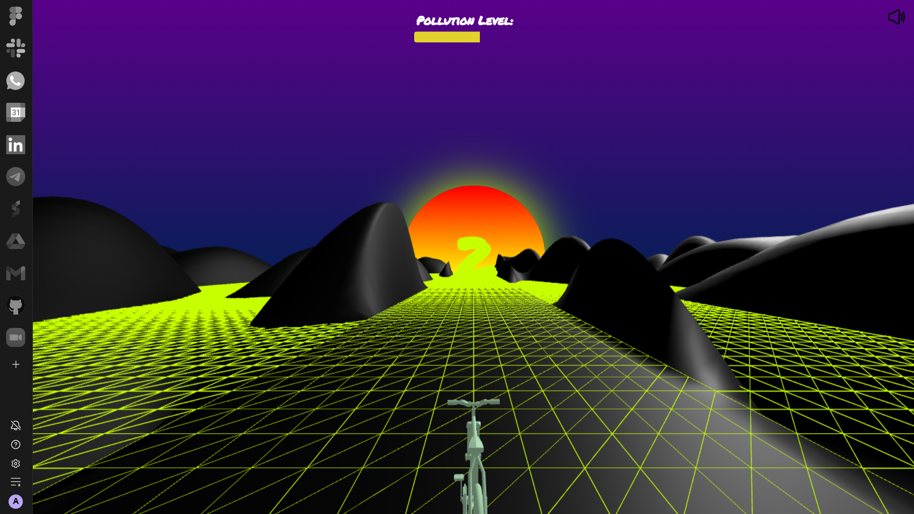

# Endless EcoQuest

Endless EcoQuest is an immersive endless racing experience built using Three.js and Socket.io. In this game, you'll navigate through an endless track, controlling your car's movements using the orientation of your mobile device.

**The main aim of this game is to raise awareness about the pollution that we are creating by making small choices in our life. In the game, the player has to reduce the pollution level by ducking the plants and choosing the right vehicles for their ride.**

- Live: [https://dgnrp9-3000.csb.app/](https://dgnrp9-3000.csb.app/)
- CodeSandbox: [https://codesandbox.io/p/github/amit-ksh/endless-ecoQuest/](https://codesandbox.io/p/github/amit-ksh/endless-ecoQuest/main)
- Github: [https://github.com/amit-ksh/endless-ecoQuest](https://github.com/amit-ksh/endless-ecoQuest/)

## How to play

1. Open this [link](https://dgnrp9-3000.csb.app/) in your desktop/laptop.
2. Once the website is loaded, open this [link](https://dgnrp9-3000.csb.app//mobile) and enter code the shown on the desktop screen.
3. Now, click the button `Play` to start playing the game.

## Controls

- Mobile Device Orientation: Tilt your mobile device left or right to control the car's movements.
- Use the `Left` & `Right` arrow keyboard buttons for changing the vehicles.

## Technologies

- Three.js: A powerful 3D graphics library for creating visually stunning web-based applications.
- Socket.io: Enables real-time, bidirectional, and event-based communication for multiplayer functionality.

## Images

